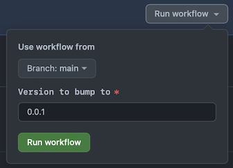

# Rust Release Workflows

The following workflows support a release process for Rust crates.

| Name | Description |
| ---- | ----------- |
| [rust-bump-version] | Updates the version in Rust crates to a input version. |
| [rust-publish-dry-run] | Run a package verification on all crates in a workspace in their published form. |
| [rust-publish] | Publish all crates in a workspace. |

[rust-bump-version]: ./rust-bump-version.yml
[rust-publish-dry-run]: ./rust-publish-dry-run.yml
[rust-publish]: ./rust-publish.yml

The [Rust crates at @stellar][crates] are released using the following process:

[crates]: https://github.com/orgs/stellar/repositories?language=rust

  - [1. Bump Version](#1-bump-version)
  - [2. Review PR](#2-review-pr)
  - [3. Merge PR](#3-merge-pr)
  - [4. Create Release on GitHub](#4-create-release-on-github)
  - [5. Close PR](#5-close-pr)
  - [6. Monitor the Publish](#6-monitor-the-publish)

Note that this release process leans into trunk-based releasing, where most
releases occur directly from the `main` branch. If patches need to be made to
past releases:
1. Create a release by performing step 1 below.
2. Then:
   - Make the changes on the `main` branch first then backport to the `release/`
   branch.
   - Or, open PRs against or push changes to the `release/` branch, then
   cherry-pick those changes back up onto `main` in new PRs.
3. Then, continue from step 2 below.

## 1. Bump Version

Each Rust repo has a workflow that can be triggered manually, called the `Bump
Version` workflow.

Using the `rs-soroban-sdk` repo as an example:

1. Go to https://github.com/stellar/rs-soroban-sdk/actions/workflows/bump-version.yml.

2. Click `Run workflow`, choose the branch, and enter the version the crates in the repository should be bumped to.

    The branch selected is the branch that the release process is to be started
    from. It will usually be the `main` branch for the next planned release. If
    the release is to branch off of a past release, such as when we're releasing
    a patch, select the tag for that past release.

    

    Clicking the green `Run workflow` button will kick off a workflow that:
    - Updates the version of all crates in the repo to the input version.
    - Create a branch with name `release/v<version>`.
    - Open a PR for the branch to merge to `main`.

_Note that this part of the release process does not yet support releasing from
a non-main branch. See [#23](https://github.com/stellar/actions/issues/23) for
more information._

## 2. Review PR

A PR will be opened that looks like this:

Make any changes to the `release/vX.Y.Z` branch needed to prepare for this
release. This will probably involve:
 - Updating the versions of any dependencies that have since been released that
 the crates are dependent on. It's important to update any corresponding
 `[patch.*]` entries to match as well.
 - Update any docs.

_CI will run the [rust-publish-dry-run] checks on `release/*` branches to verify
that when the crates are published their publish will succeed. This means you
might see errors on CI that didn't exist before. These errors need resolving. If
you see any errors you don't understand, ask in [#lang-rust]._

## 3. Merge PR

**Skip this step if releasing from the release branch for a patch of a past
release.**

When the build is passing and you're ready to release, squash merge the PR to
the `main` branch.

## 4. Create Release on GitHub

First check that the `publish-dry-run` CI jobs have succeeded for the commit to
be released.

Draft a new release on GitHub for the repository.

Specify the commit to be tagged as the latest commit on the `main` branch if
step 3 was performed. Otherwise, use the commit on the `release/` branch.

## 5. Close PR

**Skip this step if releasing from the `main` branch for a regular release,
*since the PR is already merged.**

Once the release is created close the release branch PR. If there are changes on
that branch that should be ported to `main`, do that separately by
cherry-picking the commits.

## 6. Monitor the Publish

An action will be started to perform the publish. The action can be found on the
`Actions` tab of the repository. Follow along to make sure it goes smoothly.

Published crates will be visible at https://crates.io/users/stellar-crates?sort=recent-updates.

[#lang-rust]: https://stellarfoundation.slack.com/archives/C03BQJ34VGQ
