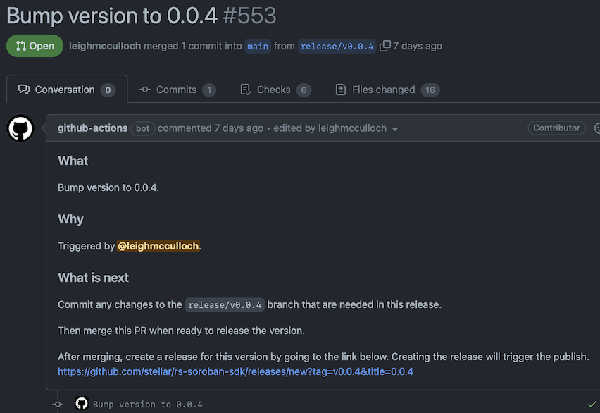

# Rust Release Workflows

The [Rust crates at @stellar][crates] are released using the following process:

[crates]: https://github.com/orgs/stellar/repositories?language=rust

  - [Step 1. Run the Bump Version Workflow]
  - [Step 2. Review PR]
  - [Step 3. Merge PR] (for `main` branch releases)
  - [Step 4. Create Release on GitHub]
  - [Step 5. Close PR] (for patches to past releases)
  - [Step 6. Monitor the Publish]

[Step 1. Run the Bump Version Workflow]: #step-1-create-release-branch-with-the-bump-version-workflow
[Step 2. Review PR]: #step-2-review-pr
[Step 3. Merge PR]: #step-3-merge-pr
[Step 4. Create Release on GitHub]: #step-4-create-release-on-github
[Step 5. Close PR]: #step-5-merge-pr
[Step 6. Monitor the Publish]: #step-6-monitor-the-publish

The following workflows support the release process:

| Name | Description |
| ---- | ----------- |
| [rust-bump-version] | Updates the version in Rust crates to a input version. |
| [rust-publish-dry-run] | Run a package verification on all crates in a workspace in their published form. |
| [rust-publish-dry-run-v2] | Run a package verification on all crates in a workspace in their published form. |
| [rust-publish] | Publish all crates in a workspace. |

[rust-bump-version]: ./rust-bump-version/workflow.yml
[rust-publish-dry-run]: ./rust-publish-dry-run/workflow.yml
[rust-publish-dry-run-v2]: ./rust-publish-dry-run-v2/workflow.yml
[rust-publish]: ./rust-publish/workflow.yml

## Release Types

### Regular Releases
The release process defaults to trunk-based releasing, where releases occur
directly from the `main` branch. For these types of regular releases follow the
steps 1-6.

### Patching Past Releases
If patches need to be made to past releases, use a modified flow:
- Step 1. Run the Bump Version Workflow, selecting the past release as the
starting branch.
- Then:
   - Make the changes on the `main` branch first then backport to the `release/`
   branch.
   - Or, open PRs against or push changes to the `release/` branch, then
   cherry-pick those changes back up onto `main` in new PRs.
- Then, continue from step 2 below.

## Step 1. Run the Bump Version Workflow

Each Rust repo has a workflow called the `Bump Version` workflow. It can be triggered manually, and it will create a new branch where the release can be prepared.

Using the `rs-soroban-sdk` repo as an example:

- Go to https://github.com/stellar/rs-soroban-sdk/actions/workflows/bump-version.yml.

- Click `Run workflow`, choose the branch, and enter the version the crates in the repository should be bumped to.

    The branch selected is the branch that the release process is to be started
    from. It will usually be the `main` branch for the next planned release. If
    the release is to branch off of a past release, such as when we're releasing
    a patch, select the tag for that past release.

    

    Clicking the green `Run workflow` button will kick off a workflow that:
    - Updates the version of all crates in the repo to the input version.
    - Create a branch with name `release/v<version>`.
    - Open a PR for the branch to merge to `main`.

## 2. Review PR

A PR will be opened that looks like this:

First, close and open the PR. This seems silly, but GitHub won't run workflows
on PRs opened by a bot. Simply clicking the close and open buttons on the PR
will kick off the builds.

Make any changes to the `release/vX.Y.Z` branch needed to prepare for this
release. This will probably involve:
 - Updating the versions and git refs of any dependencies that have since been
 released that the crates are dependent on.
 - Update any docs.

_CI will run the [rust-publish-dry-run] or [rust-publish-dry-run-v2] checks on
`release/*` branches to verify that when the crates are published their publish
will succeed. This means you might see errors on CI that didn't exist before.
These errors need resolving. If you see any errors you don't understand, ask in
[#lang-rust]._

## 3. Merge PR

**Skip this step if releasing from the release branch for a patch of a past
release.**

When the build is passing and you're ready to release, squash merge the PR to
the `main` branch.

## 4. Create Release on GitHub

First check that the `publish-dry-run` or `publish-dry-run-v2` CI jobs have
succeeded for the commit to be released.

Draft a new release on GitHub for the repository by clicking on the relevant
release link in the description of the PR from step 2.

Specify the commit to be tagged as the latest commit on the `main` branch if
step 3 was performed. Otherwise, use the commit on the `release/` branch. Then
click on the `Generate release notes` button to fill out the description of the
release.

## 5. Close PR

**Skip this step if releasing from the `main` branch for a regular release,
*since the PR is already merged.**

Once the release is created close the release branch PR. If there are changes on
that branch that should be ported to `main`, do that separately by
cherry-picking the commits.

## 6. Monitor the Publish

An action will be started to perform the publish. The action can be found on the
`Actions` tab of the repository. Follow along to make sure it goes smoothly.

Published crates will be visible at https://crates.io/users/stellar-crates?sort=recent-updates.

[#lang-rust]: https://stellarfoundation.slack.com/archives/C03BQJ34VGQ
